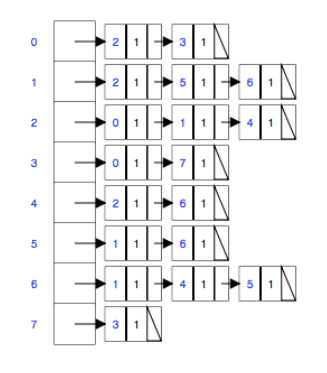
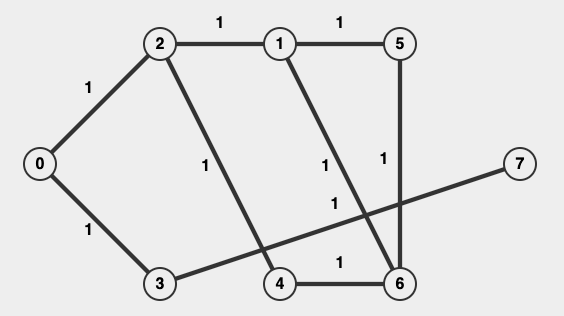

# Homework 1 Documentation
**Author:** Omkar Yadav

---

## Q1: CHARACTERS MEDIAN AND MODE

Given an array of size **n** that contains only Latin characters, describe an efficient algorithm that finds the median (lower if 'n' is even) and the mode (most frequent element). If there are multiple elements that appear the maximum number of times, output any one of them.

What is the time and space complexity?

**Examples:**
```
Input: array a[] = {F, A, D, A, B, A}  
Output: Mode = A, Median = A

Input: array a[] = {G, F, R, R, C}  
Output: Mode = R, Median = G
```

### Assumption 
Latin characters refer to ASCII characters and exclude UTF-8 special characters.

### Brute Force Approach
**Sorting**: Sort the array and find the median and mode in one pass.

Time: $O(n\lg n)$, Space: $O(\lg n)$ 


### Optimal Approach
**Optimal**: This approach employs a frequency array of size 52, representing uppercase and lowercase characters. The frequency array is used to compute the median and mode in constant time and space.

### Pseudocode
```text
procedure MEDIAN-AND-MODE(data[1..n])
  declare freq[1..52] := {0}
  for i := 1 to n
    // Populate freq based on data
  return (FIND-MEDIAN(freq, n), FIND-MODE(freq))

function FIND-MEDIAN(freq[1..52], n)
  medianIndex := ⌈n/2⌉
  // Determine median character based on freq in constant time
  return medianChar

function FIND-MODE(freq[1..52])
  // Determine mode character based on freq in constant time
  return modeChar
```


### Code Snippet

[//]: # (<details>)

[//]: # (<summary>Expand</summary>)

```cpp
class Question1 {
public:
    pair<char, char> charactersMedianAndMode(const vector<char>& data) {
        vector<int> freq(52);
        for(char c: data) {
            if(c >= 'a' and c <= 'z') freq[c - 'a']++;
            else if(c >= 'A' and c <= 'Z') freq[c - 'A' + 26]++;
        }
        return {getMedian(freq, (int) data.size()), getMode(freq)};
    }

    char getMedian(vector<int>& freq, int n) {
        int medianIndex = (n % 2 == 0) ? (n / 2) - 1 : n / 2;
        int cumulativeFreq = 0;
        int median = 0;

        for(int i = 0; i < freq.size(); i++) {
            cumulativeFreq += freq[i];
            if(cumulativeFreq > medianIndex) {
                median = i;
                break;
            }
        }

        return median < 26 ? median + 'a' : median - 26 + 'A';
    }

    char getMode(vector<int>& freq) {
        int modeCount = 0;
        int modeIndex = 0;

        for(int i = 0; i < freq.size(); i++) {
            if(freq[i] > modeCount) {
                modeCount = freq[i];
                modeIndex = i;
            }
        }

        return modeIndex < 26 ? modeIndex + 'a' : modeIndex - 26 + 'A';
    }
};
```

[//]: # (</details>)

### Analysis
**Time Complexity:** $O(n)$
- Where n is the size of the input array. 
- The algorithm iterates through the input array once to compute frequencies. After this, processing on the frequency array is in constant time due to its fixed size.

**Space Complexity:** $O(1)$
- As the frequency array is of fixed size, the algorithm uses constant space.

---

## Q2: WHERE IS THE ZERO?
Alice has a sorted array `A[1, . . . , n]` with distinct positive numbers. Now Bob has another almost
sorted array `B[1, . . . , n + 1]`, which is derived from inserting a zero into A. Help Bob to discover
the index of this zero. Design and analyze an efficient algorithm for him to find the index of the
zero in B. 

Hint: use A and B in your solution.

**Example:**
```
If
A ∶ 1, 3, 4, 6, 7, 8, 9, 20
B ∶ 1, 3, 0, 4, 6, 7, 8, 9, 20.

Your algorithm should return 3 in this case, 
which is the index of the zero in B (starting from 1).
```

### Assumption
Array A only contains positive numbers.

### Brute Force Approach
Linear search for 0 in array B.

Time: $O(n)$, Space: $O(1)$

### Optimal Approach
Divide and Conquer (modified binary search) using both arrays.

### Pseudocode

```text
procedure whereIsTheZero(a, b)
  start := 0
  end := b.length

  while start <= end
    mid := start + (end - start) / 2

    if b[mid] = 0
      return mid + 1
    elif b[mid] = a[mid]
      start := mid + 1
    else
      end := mid - 1

  return b.length
```

### Code Snippet

[//]: # (<details>)

[//]: # (<summary>Expand</summary>)

```cpp
class Question2 {
public:
    static int whereIsTheZero(vector<int>& a, vector<int>& b) {
        int start = 0, end = (int) b.size();

        while(start <= end) {
            int mid = start + (end - start) / 2;
            if(b[mid] == 0) return mid + 1;
            else if(b[mid] == a[mid]) start = mid + 1;
            else end = mid - 1;
        }

        return (int) b.size();
    }
};
```

[//]: # (</details>)

### Analysis
**Time Complexity:** $O(\lg n)$
- Where n is the size of the array B.
- During each iteration, the search space is halved by adjusting either the start or end pointers. Therefore, we inspect at most $\lg n$ elements of array B.

**Space Complexity:** $O(1)$
- The algorithm consistently uses a fixed amount of extra space regardless of input size.

---

## Q3: SOCIAL GRAPH

Given the following adjacency list representation of a graph (every node has the label of the
neighbor and the weight of the edge, note all have 1 weight), draw the graph, give the visited
node order for each type of graph search, starting with 0.

<p align="center">
    
</p>

## Draw the graph




## Breadth First Search

### Pseudocode

```text
procedure breadthFirstSearch(graph, start)
  queue q
  set visited := {}

  q.enqueue(start)
  visited.add(start)

  while not q.isEmpty()
    vertex v := q.dequeue()

    for each neighbor w of v
      if not visited.contains(w)
        q.enqueue(w)
        visited.add(w)
```

### Code Snippet

[//]: # (<details>)

[//]: # (<summary>Expand</summary>)

```cpp
static vector<int> breadthFirstSearch(vector<vector<pair<int, int>>>& graph, int start) {
    vector<int> visitedOrder;
    queue<int> q;
    vector<bool> visited(graph.size(), false);

    q.push(start);
    visited[start] = true;
    visitedOrder.push_back(start);

    while(!q.empty()) {
        int cur = q.front(); q.pop();

        for(pair<int, int>& neighbor: graph[cur]) {
            if(!visited[neighbor.first]) {
                q.push(neighbor.first);
                visited[neighbor.first] = true;
                visitedOrder.push_back(neighbor.first);
            }
        }
    }

    return visitedOrder;
}
```

[//]: # (</details>)

### Analysis
**Time Complexity:** $O(V \+ E)$
- Where V is the number of vertices, and E is the number of edges in the graph.
- BFS visits all vertices in the graph and all edges which connect these vertices.

**Space Complexity:** $O(V)$
- Where V is the number of vertices in the graph.
- BFS maintains a queue of vertices that need to be visited next.

## Depth First Search

### Pseudocode

```text
procedure DFS(graph, start)
  set visited := {}
  visitedOrder := []

  dfsHelper(start, graph, visited, visitedOrder)

  return visitedOrder

procedure dfsHelper(v, graph, visited, visitedOrder)
  visited.add(start)
  visitedOrder.append(v)

  for neighbor w in graph[v]:
    if not visited.contains(w):
      dfsHelper(w, graph, visited, visitedOrder)
```

### Code Snippet

[//]: # (<details>)

[//]: # (<summary>Expand</summary>)

```c++
void dfsHelper(int start, vector<vector<pair<int, int>>>& graph, vector<bool>& visited, vector<int>& visitedOrder) {
    visited[start] = true;
    visitedOrder.push_back(start);

    for(pair<int, int>& neighbor: graph[start]) {
        if(!visited[neighbor.first]) {
            dfsHelper(neighbor.first, graph, visited, visitedOrder);
        }
    }
}

vector<int> depthFirstSearch(vector<vector<pair<int, int>>>& graph, int start) {
    vector<int> visitedOrder;
    vector<bool> visited(graph.size(), false);
    dfsHelper(start, graph, visited, visitedOrder);
    return visitedOrder;
}
```

[//]: # (</details>)

### Analysis
**Time Complexity:** $O(V \+ E)$
- Where V is the number of vertices, and E is the number of edges in the graph.
- DFS visits all vertices in the graph and all edges which connect these vertices.

**Space Complexity:** $O(V)$
- Where V is the number of vertices in the graph.
- DFS stores a stack of vertices that have not yet been visited. Recursive DFS, as in above code, uses the call stack.

## Give the length of the shortest path from 0 to 5

For the input graph, there are 2 ways to find the shortest path from 0 to 5. 
BFS and Dijkstra's. However, in a graph where all costs are equal, Dijkstra = BFS. 
In such a graph, the shortest path is always the path that visits the fewest number of edges.

### Dijkstra's Algorithm Pseudocode

```text
procedure DijkstraShortestPath(graph, start)
  distance := array(graph.size, ∞)
  distance[start] := 0
  queue := priority queue of (vertex, distance) based on distance
  queue.enqueue((start, 0))

  while queue is not empty
    (cur, dist) := queue.dequeue()

    for neighbor in graph[cur]
      if distance[neighbor] > dist + graph[cur][neighbor]
        distance[neighbor] := dist + graph[cur][neighbor]
        queue.enqueue((neighbor, distance[neighbor]))

  return distance
```

### BFS Shortest Path Pseudocode

```text
procedure BFSShortestPath(graph, start)
  distance := array(graph.size, ∞)
  distance[start] := 0
  queue := queue of vertex
  queue.enqueue(start)

  while queue is not empty
    cur := queue.dequeue()

    for neighbor in graph[cur]
      if distance[neighbor] == ∞
        distance[neighbor] := distance[cur] + 1
        queue.enqueue(neighbor)

  return distance
```

### BFS Shortest Path Code Snippet

```c++
static vector<int> bfsShortestPath(vector<vector<pair<int, int>>>& graph, int start) {
    queue<int> q;
    vector<int> distance(graph.size(), INT_MAX);

    q.push(start);
    distance[start] = 0;

    while(!q.empty()) {
        int cur = q.front(); q.pop();

        for(pair<int, int>& neighbor: graph[cur]) {
            if(distance[neighbor.first] == INT_MAX) {
                q.push(neighbor.first);
                distance[neighbor.first] = distance[cur] + 1;
            }
        }
    }
    return distance;
}
```

### Analysis
**Time Complexity:** $O(V \+ E)$
- Where V is the number of vertices, and E is the number of edges in the graph.
- BFS visits all vertices in the graph and all edges which connect these vertices.

**Space Complexity:** $O(V)$
- Where V is the number of vertices in the graph.
- BFS maintains a queue of vertices that need to be visited next. Which in the worst case, could be all the vertices.