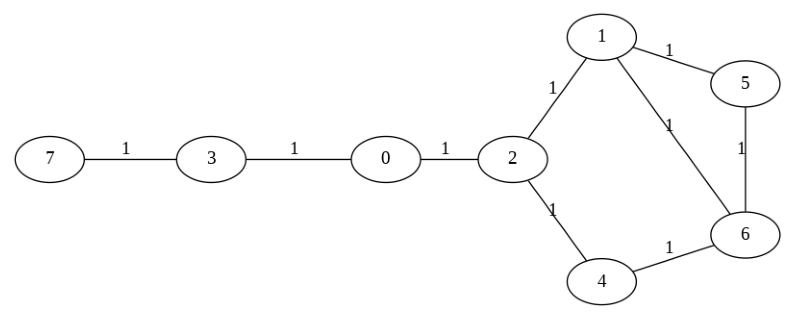

# Homework 1 Documentation
- **Class:** CS 255 DAA by Katerina Potika
- **Author:** Omkar Yadav

---

## Q1: CHARACTERS MEDIAN AND MODE

Given an array of size **n** that contains only Latin characters, describe an efficient algorithm that finds the median (lower if 'n' is even) and the mode (most frequent element). If there are multiple elements that appear the maximum number of times, output any one of them.

What is the time and space complexity?

**Examples:**
```
Input: array a[] = {F, A, D, A, B, A}  
Output: Mode = A, Median = A

Input: array a[] = {G, F, R, R, C}  
Output: Mode = R, Median = G
```

### Assumption 
Latin characters refer to ASCII characters and exclude UTF-8 special characters.

### Brute Force Approach
**Sorting**: Sort the array and find the median and mode in one pass.

Time: $O(n\lg n)$, Space: $O(\lg n)$ 


### Optimal Approach
**Optimal**: This approach employs a frequency array of size 52, representing uppercase and lowercase characters. The frequency array is used to compute the median and mode in constant time and space.

### Pseudocode
```text
procedure MEDIAN-AND-MODE(data[1..n])
  declare freq[1..52] := {0}
  for i := 1 to n
    // Populate freq based on data
  return (FIND-MEDIAN(freq, n), FIND-MODE(freq))

function FIND-MEDIAN(freq[1..52], n)
  medianIndex := ⌈n/2⌉
  // Determine median character based on freq in constant time
  return medianChar

function FIND-MODE(freq[1..52])
  // Determine mode character based on freq in constant time
  return modeChar
```


### Code Snippet

[//]: # (<details>)

[//]: # (<summary>Expand</summary>)

```cpp
class Question1 {
public:
    pair<char, char> charactersMedianAndMode(const vector<char>& data) {
        vector<int> freq(52);
        for(char c: data) {
            if(c >= 'a' and c <= 'z') freq[c - 'a']++;
            else if(c >= 'A' and c <= 'Z') freq[c - 'A' + 26]++;
        }
        return {getMedian(freq, (int) data.size()), getMode(freq)};
    }

    char getMedian(vector<int>& freq, int n) {
        int medianIndex = (n % 2 == 0) ? (n / 2) - 1 : n / 2;
        int cumulativeFreq = 0;
        int median = 0;

        for(int i = 0; i < freq.size(); i++) {
            cumulativeFreq += freq[i];
            if(cumulativeFreq > medianIndex) {
                median = i;
                break;
            }
        }

        return median < 26 ? median + 'a' : median - 26 + 'A';
    }

    char getMode(vector<int>& freq) {
        int modeCount = 0;
        int modeIndex = 0;

        for(int i = 0; i < freq.size(); i++) {
            if(freq[i] > modeCount) {
                modeCount = freq[i];
                modeIndex = i;
            }
        }

        return modeIndex < 26 ? modeIndex + 'a' : modeIndex - 26 + 'A';
    }
};
```

[//]: # (</details>)

### Analysis
**Time Complexity:** $O(n)$
- Where n is the size of the input array. 
- The algorithm iterates through the input array once to compute frequencies. After this, processing on the frequency array is in constant time due to its fixed size.

**Space Complexity:** $O(1)$
- As the frequency array is of fixed size, the algorithm uses constant space.

---

## Q2: WHERE IS THE ZERO?
Alice has a sorted array `A[1, . . . , n]` with distinct positive numbers. Now Bob has another almost
sorted array `B[1, . . . , n + 1]`, which is derived from inserting a zero into A. Help Bob to discover
the index of this zero. Design and analyze an efficient algorithm for him to find the index of the
zero in B. 

Hint: use A and B in your solution.

**Example:**
```
If
A ∶ 1, 3, 4, 6, 7, 8, 9, 20
B ∶ 1, 3, 0, 4, 6, 7, 8, 9, 20.

Your algorithm should return 3 in this case, 
which is the index of the zero in B (starting from 1).
```

### Assumption
Array A only contains positive numbers.

### Brute Force Approach
Linear search for 0 in array B.

Time: $O(n)$, Space: $O(1)$

### Optimal Approach
Divide and Conquer (modified binary search) using both arrays.

### Pseudocode

```text
procedure whereIsTheZero(a, b)
  start := 0
  end := b.length

  while start <= end
    mid := start + (end - start) / 2

    if b[mid] == 0
      return mid + 1
    elif b[mid] == a[mid]
      start := mid + 1
    else
      end := mid - 1

  return b.length
```

### Code Snippet

[//]: # (<details>)

[//]: # (<summary>Expand</summary>)

```cpp
class Question2 {
public:
    static int whereIsTheZero(vector<int>& a, vector<int>& b) {
        int start = 0, end = (int) b.size();

        while(start <= end) {
            int mid = start + (end - start) / 2;
            if(b[mid] == 0) return mid + 1;
            else if(b[mid] == a[mid]) start = mid + 1;
            else end = mid - 1;
        }

        return (int) b.size();
    }
};
```

[//]: # (</details>)

### Analysis
**Time Complexity:** $O(\lg n)$
- Where n is the size of the array B.
- During each iteration, the search space is halved by adjusting either the start or end pointers. Therefore, we inspect at most $\lg n$ elements of array B.

**Space Complexity:** $O(1)$
- The algorithm consistently uses a fixed amount of extra space regardless of input size.

---

## Q3: SOCIAL GRAPH

Given the following adjacency list representation of a graph (every node has the label of the
neighbor and the weight of the edge, note all have 1 weight), draw the graph, give the visited
node order for each type of graph search, starting with 0.

<p align="center">
    
</p>

## Draw the graph




## Breadth First Search

### BFS Order: `0 2 3 1 4 7 5 6`

### Pseudocode

```text
procedure breadthFirstSearch(graph, start)
  queue q
  set visited := {}

  q.enqueue(start)
  visited.add(start)

  while not q.isEmpty()
    vertex v := q.dequeue()

    for each neighbor w of v
      if not visited.contains(w)
        q.enqueue(w)
        visited.add(w)
```

### BFS Queue Progression

```text
Initial:        | Queue: [ 0 ]

Current Node: 0 | Queue: [ 2, 3 ]
Current Node: 2 | Queue: [ 3, 1, 4 ]
Current Node: 3 | Queue: [ 1, 4, 7 ]
Current Node: 1 | Queue: [ 4, 7, 5, 6 ]
Current Node: 4 | Queue: [ 7, 5, 6 ]
Current Node: 7 | Queue: [ 5, 6 ]
Current Node: 5 | Queue: [ 6 ]
Current Node: 6 | Queue: [  ]
```

### Code Snippet

[//]: # (<details>)

[//]: # (<summary>Expand</summary>)

```cpp
static vector<int> breadthFirstSearch(vector<vector<pair<int, int>>>& graph, int start) {
    vector<int> visitedOrder;
    queue<int> q;
    vector<bool> visited(graph.size(), false);

    q.push(start);
    visited[start] = true;
    visitedOrder.push_back(start);

    while(!q.empty()) {
        int cur = q.front(); q.pop();

        for(pair<int, int>& neighbor: graph[cur]) {
            if(!visited[neighbor.first]) {
                q.push(neighbor.first);
                visited[neighbor.first] = true;
                visitedOrder.push_back(neighbor.first);
            }
        }
    }

    return visitedOrder;
}
```

[//]: # (</details>)

### Analysis
**Time Complexity:** $O(V \+ E)$
- Where V is the number of vertices, and E is the number of edges in the graph.
- BFS visits all vertices in the graph and all edges which connect these vertices.

**Space Complexity:** $O(V)$
- Where V is the number of vertices in the graph.
- BFS maintains a queue of vertices that need to be visited next.

## Depth First Search

### DFS Order: `0 2 1 5 6 4 3 7`

### Pseudocode

```text
procedure DFS(graph, start)
  set visited := {}
  visitedOrder := []

  dfsHelper(start, graph, visited, visitedOrder)

  return visitedOrder

procedure dfsHelper(v, graph, visited, visitedOrder)
  visited.add(start)
  visitedOrder.append(v)

  for neighbor w in graph[v]:
    if not visited.contains(w):
      dfsHelper(w, graph, visited, visitedOrder)
```

### DFS Call Stack Progression
```text
Initial:           | Call Stack: [ ]

DFS(0):            | Call Stack: [ 0 ]
DFS(2):            | Call Stack: [ 0, 2 ]
DFS(1):            | Call Stack: [ 0, 2, 1 ]
DFS(5):            | Call Stack: [ 0, 2, 1, 5 ]
DFS(6):            | Call Stack: [ 0, 2, 1, 5, 6 ]
DFS(4):            | Call Stack: [ 0, 2, 1, 5, 6, 4 ]
Return from DFS(4) | Call Stack: [ 0, 2, 1, 5, 6 ]
Return from DFS(6) | Call Stack: [ 0, 2, 1, 5 ]
Return from DFS(5) | Call Stack: [ 0, 2, 1 ]
Return from DFS(1) | Call Stack: [ 0, 2 ]
Return from DFS(2) | Call Stack: [ 0 ]
DFS(3):            | Call Stack: [ 0, 3 ]
DFS(7):            | Call Stack: [ 0, 3, 7 ]
Return from DFS(7) | Call Stack: [ 0, 3 ]
Return from DFS(3) | Call Stack: [ 0 ]
Return from DFS(0) | Call Stack: [ ]
```

### Code Snippet

[//]: # (<details>)

[//]: # (<summary>Expand</summary>)

```c++
void dfsHelper(int start, vector<vector<pair<int, int>>>& graph, vector<bool>& visited, vector<int>& visitedOrder) {
    visited[start] = true;
    visitedOrder.push_back(start);

    for(pair<int, int>& neighbor: graph[start]) {
        if(!visited[neighbor.first]) {
            dfsHelper(neighbor.first, graph, visited, visitedOrder);
        }
    }
}

vector<int> depthFirstSearch(vector<vector<pair<int, int>>>& graph, int start) {
    vector<int> visitedOrder;
    vector<bool> visited(graph.size(), false);
    dfsHelper(start, graph, visited, visitedOrder);
    return visitedOrder;
}
```

[//]: # (</details>)

### Analysis
**Time Complexity:** $O(V \+ E)$
- Where V is the number of vertices, and E is the number of edges in the graph.
- DFS visits all vertices in the graph and all edges which connect these vertices.

**Space Complexity:** $O(V)$
- Where V is the number of vertices in the graph.
- DFS stores a stack of vertices that have not yet been visited. Recursive DFS, as in above code, uses the call stack.

## Give the length of the shortest path from 0 to 5

### Length of the shortest path from 0 to 5: `3`

### Approach
For the input graph, there are 2 ways to find the shortest path from 0 to 5. 
BFS and Dijkstra's. However, in a graph where all costs are equal, Dijkstra = BFS. 
In such a graph, the shortest path is always the path that visits the fewest number of edges.

### Dijkstra's Algorithm Pseudocode

```text
procedure DijkstraShortestPath(graph, start)
  distance := array(graph.size, ∞)
  distance[start] := 0
  queue := priority queue of (vertex, distance) based on distance
  queue.enqueue((start, 0))

  while queue is not empty
    (cur, dist) := queue.dequeue()

    for neighbor in graph[cur]
      if distance[neighbor] > dist + graph[cur][neighbor]
        distance[neighbor] := dist + graph[cur][neighbor]
        queue.enqueue((neighbor, distance[neighbor]))

  return distance
```

### BFS Shortest Path Pseudocode

```text
procedure BFSShortestPath(graph, start)
  distance := array(graph.size, ∞)
  distance[start] := 0
  queue := queue of vertex
  queue.enqueue(start)

  while queue is not empty
    cur := queue.dequeue()

    for neighbor in graph[cur]
      if distance[neighbor] == ∞
        distance[neighbor] := distance[cur] + 1
        queue.enqueue(neighbor)

  return distance
```

### BFS Shortest Path Progression

```text
Initial:        | Queue: [ 0 ]          | Distance: [ 0, ∞, ∞, ∞, ∞, ∞, ∞, ∞ ]

Current Node 0: | Queue: [ 2, 3 ]       | Distance: [ 0, ∞, 1, 1, ∞, ∞, ∞, ∞ ]
Current Node 2: | Queue: [ 3, 1, 4 ]    | Distance: [ 0, 2, 1, 1, 2, ∞, ∞, ∞ ]
Current Node 3: | Queue: [ 1, 4, 7 ]    | Distance: [ 0, 2, 1, 1, 2, ∞, ∞, 2 ]
Current Node 1: | Queue: [ 4, 7, 5, 6 ] | Distance: [ 0, 2, 1, 1, 2, 3, 3, 2 ]
Current Node 4: | Queue: [ 7, 5, 6 ]    | Distance: [ 0, 2, 1, 1, 2, 3, 3, 2 ]
Current Node 7: | Queue: [ 5, 6 ]       | Distance: [ 0, 2, 1, 1, 2, 3, 3, 2 ]
Current Node 5: | Queue: [ 6 ]          | Distance: [ 0, 2, 1, 1, 2, 3, 3, 2 ]
Current Node 6: | Queue: [  ]           | Distance: [ 0, 2, 1, 1, 2, 3, 3, 2 ]
```

### BFS Shortest Path Code Snippet

```c++
static vector<int> bfsShortestPath(vector<vector<pair<int, int>>>& graph, int start) {
    queue<int> q;
    vector<int> distance(graph.size(), INT_MAX);

    q.push(start);
    distance[start] = 0;

    while(!q.empty()) {
        int cur = q.front(); q.pop();

        for(pair<int, int>& neighbor: graph[cur]) {
            if(distance[neighbor.first] == INT_MAX) {
                q.push(neighbor.first);
                distance[neighbor.first] = distance[cur] + 1;
            }
        }
    }
    return distance;
}
```

### Analysis
**Time Complexity:** $O(V \+ E)$
- Where V is the number of vertices, and E is the number of edges in the graph.
- BFS visits all vertices in the graph and all edges which connect these vertices.

**Space Complexity:** $O(V)$
- Where V is the number of vertices in the graph.
- BFS maintains a queue of vertices that need to be visited next. Which in the worst case, could be all the vertices.

---

## Q4: TOPOLOGICAL SORTING
Run the topological sort algorithm on the graph (Hint: where should you start?)

<p align="center">
    
</p>

### Topological Order: `e b g f d c a`

### Assumption
The graph this solution is expected to topologically sort is a DAG.

### DFS Approach
This algorithm performs DFS and pushes the node to a stack on backtracking.
To ensure all nodes are covered, it initiates DFS over all nodes.

### DFS Topological Sort Pseudocode
```text
procedure DFSTopologicalSort(graph)
  visited := set of vertex
  topo := stack of vertex

  for each vertex v in graph
    if v not in visited
      dfs(v, graph, visited, topo)

  return topo

procedure dfs(v, graph, visited, topo)
  visited.add(v)

  for each neighbor w of v
    if w not in visited
      dfs(w, graph, visited, topo)

  topo.push(v)
```

### DFS Topological Sort Code Snippet
```c++
stack<char> dfsTopologicalSort(unordered_map<char, vector<char>>& graph) {
    stack<char> topo;
    unordered_set<char> visited;
    for(auto& [key, value]: graph){
        if(visited.find(key) == visited.end()) {
            dfs(key, graph, visited, topo);
        }
    }
    return topo;
}

void dfs(char vertex, unordered_map<char, vector<char>>& graph, unordered_set<char>& visited, stack<char>& topo) {
    visited.insert(vertex);

    for(char& neighbor: graph[vertex]) {
        if(visited.find(neighbor) == visited.end()) {
            dfs(neighbor, graph, visited, topo);
        }
    }
    topo.push(vertex);
}
```

### DFS Topological Sort Analysis
**Time Complexity:** $O(V \+ E)$
- Where V is the number of vertices, and E is the number of edges in the graph.
- DFS visits all vertices in the graph and all edges which connect these vertices.

**Space Complexity:** $O(V)$
- Where V is the number of vertices in the graph.
- The `visited` set, recursive call stack, and `topo` stack each takes $O(V)$ space.

### Kahn's Algorithm Approach
This algorithm calculates the indegree of nodes. 
It then repeatedly removes nodes with indegree zero and updates the indegree of its neighbors.
It starts with a node of indegree zero.

### Kahn's Algorithm Pseudocode
```text
procedure KahnTopologicalSort(graph)
  indegree := map of vertex to indegree
  topo := empty list of vertex for result
  queue := empty queue of vertex

  for each vertex v in graph
    if indegree[v] == 0
      queue.enqueue(v)

  while queue is not empty
    v := queue.dequeue()
    topo.append(v)

    for each neighbor w of v
      indegree[w] := indegree[w] - 1
      if indegree[w] == 0
        queue.enqueue(w)

  return topo
```

### Kahn's Algorithm Code Snippet
```c++
static vector<char> kahnsTopologicalSort(unordered_map<char, vector<char>>& graph) {
    vector<char> topo;
    unordered_map<char, int> indegree;

    for(auto& [key, value]: graph) {
        for(auto& node: value) indegree[node]++;
    }

    queue<char> q;
    for(auto& [key, value]: graph) {
        if(indegree[key] == 0) q.push(key);
    }

    while(!q.empty()) {
        char cur = q.front();
        q.pop();
        topo.push_back(cur);
        for(auto& neighbor: graph[cur]) {
            indegree[neighbor]--;
            if(indegree[neighbor] == 0) q.push(neighbor);
        }
    }

    return topo;
}
```

### Kahn's Algorithm Analysis
**Time Complexity:** $O(V \+ E)$
- Where V is the number of vertices, and E is the number of edges in the graph.
- This algorithm processes all vertices in the graph and all edges once.

**Space Complexity:** $O(V)$
- Where V is the number of vertices in the graph.
- The `indegree` map, and the queue used to store nodes with zero indegree, each take $O(V)$ space.

---

## Q5: MATCHING CLASSES

### 1.
```java
public static int f1(int n) {
    int x = 0;
    for (int i = 0; i < n; i++)
        x++;
    return x;
} 
```
The function loops over n once.
#### Answer: B. $O(n)$
 
### 2.
```java
public static int f2(int n) {
    if (n == 0) return 0;
    return f2(n/2) + f1(n) + f2(n/2);
} 
```
The function has a similar recurrence relation to Merge Sort.
#### Answer: C. $O(n\log n)$

### 3.
```java
public static int f3(int n) {
    if (n == 0 || n == 1) return 1;
    return f3(n-1) + f1(n);
}
```
The function has a similar recurrence relation to Quick Sort's worst case.
#### Answer: D. $O(n^2)$

### 4.
```java
public static int f4(int n) {
    if (n == 1) return 0;
    return 1 + f4(n/3);
}
```
The function recursively calls itself on a third of its input until the base case.
The function has a similar recurrence relation to ternary search. The time complexity will be $O(\log_3 n)$
#### Answer: A. $O(\log n)$

### 5.
```java
public static int f6(int n) {
    if (n == 1) return 0;
    return 1 + f6(n/3) +f6(n/3) +f6(n/3);
}
```
The function has a recurrence relation of $T(n) = 3T\left(\frac{n}{3}\right) + O(1)
$.
This is Case 1 of Master's Theorem.

#### Answer: A. $O(n)$

---

## Q6: MULTIGRAPH TO SIMPLE GRAPH

Given an adjacency-list representation of a multigraph G =(V, E), describe an O(V + E)-time
algorithm to compute the adjacency-list representation of the “equivalent” undirected graph
G’=(V,E’), where E’ consists of the edges in E with all multiple edges between two vertices
replaced by a single edge and with all self-loops removed.

### Input Multi Graph


### Pseudocode

```text
procedure multiToSimple(multiGraph)
  simpleGraph := result simple graph

  for each vertex v in multiGraph
    uniqueEdges := unordered set to store unique edges of this vertex

    for each neighbor w of v
      if v != w
        uniqueEdges.insert(w)

    simpleGraph.append(list(uniqueEdges))

  return simpleGraph
```

### Code Snippet

```c++
static vector<vector<int>> multiToSimple(const vector<vector<int>>& multiGraph) {
    vector<vector<int>> simpleGraph;
    for(int vertex = 0; vertex < multiGraph.size(); vertex++) {
        set<int> uniqueEdges;
        for(auto& neighbor: multiGraph[vertex]) {
            if(vertex != neighbor) uniqueEdges.insert(neighbor);
        }
        simpleGraph.push_back(vector<int>(uniqueEdges.begin(), uniqueEdges.end()));
    }
    return simpleGraph;
}
```

### Output Simple Graph Adjacency List
```text
0 -> 4 3 2 1 
1 -> 4 3 2 0 
2 -> 4 3 1 5 0 
3 -> 4 2 1 5 0 
4 -> 3 2 1 5 0 
5 -> 4 3 2 
```
- To get ordered adjacency lists, we can use `set` instead of `unordered_set`. This will increase time complexity to $O(V + E\lg E)$.

### Output Simple Graph


### Analysis
**Time Complexity:** $O(V \+ E)$
- Using an ordered set, the time complexity is $O(V + E\lg E)$, optimal when edge ordering in the adjacency list is a priority.
- This algorithm visits each vertex and all its respective edges once.

**Space Complexity:** $O(E)$
- At each vertex, the algorithm creates a set to eliminate any duplicate edges.
- At most the algorithm stores all the edges in the sets.


---

## Q7: LOMBARDI GRAPHS

Suppose we are given an undirected graph G = (V , E), and we identify two nodes v and w in G. Give an algorithm that
computes the number of shortest v-w paths in G. (The algorithm should not list all the paths; just
the number suffices.) The running time of your algorithm should be $O(m \+ n)$ for a graph with n
nodes and m edges.

### Input Graph


### Pseudocode

```text
procedure bfsLombardi(graph, start)
  distance := array(graph.size(), ∞)
  count := array(graph.size(), 0)

  queue := bfs queue
  queue.enqueue(start)
  distance[start] := 0
  count[start] := 1

  while queue is not empty
    cur := queue.dequeue()

    for each neighbor w of cur
      if distance[w] == ∞
        queue.enqueue(w)
        distance[w] := distance[cur] + 1
      if distance[w] == distance[cur] + 1
        count[w] += count[cur]

  return count
```

### Code Snippet

```c++
static vector<int> bfsLombardi(vector<vector<int>>& graph, int start) {
    queue<int> q;
    vector<int> distance(graph.size(), INT_MAX);
    vector<int> count(graph.size());

    q.push(start);
    distance[start] = 0;
    count[start] = 1;

    while(!q.empty()) {
        int cur = q.front(); q.pop();

        for(auto& neighbor: graph[cur]) {
            if(distance[neighbor] == INT_MAX) {
                q.push(neighbor);
                distance[neighbor] = distance[cur] + 1;
            }
            if(distance[neighbor] == distance[cur] + 1) {
                count[neighbor] += count[cur];
            }
        }
    }
    return count;
}
``` 

### Output

```text
Paths from 0 to 1: 1
Paths from 0 to 2: 1
Paths from 0 to 3: 1
Paths from 0 to 4: 2
Paths from 0 to 5: 2
Paths from 0 to 6: 4
Paths from 0 to 7: 2
Paths from 0 to 8: 6
```

### Analysis
**Time Complexity:** $O(V \+ E)$
- Where V is the number of vertices, and E is the number of edges in the graph.
- BFS visits all vertices in the graph and all edges which connect these vertices.

**Space Complexity:** $O(V)$
- Where V is the number of vertices in the graph.
- BFS maintains a queue of vertices that need to be visited next. Which in the worst case, could be all the vertices.
- The algorithm is also saving the shortest path to all vertices in a `distance` array.

---